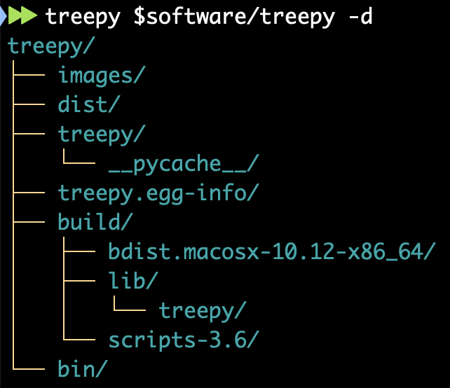
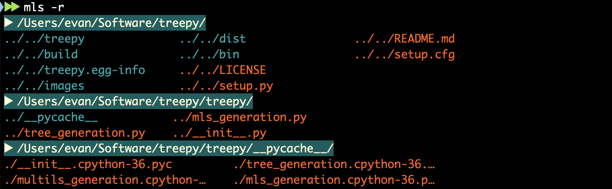
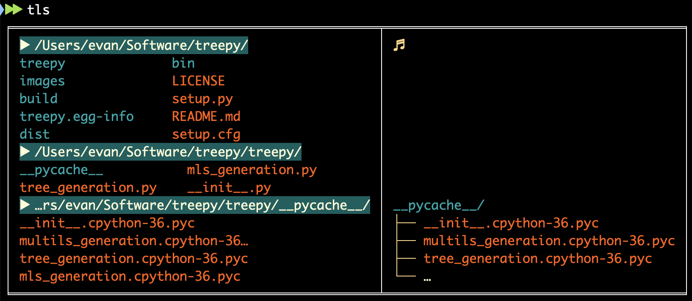

# treepy
Couple of command line utilities for visualizing filepaths in the context of their directory structure.

# Installation

**PyPI:**

```
pip install treepy
```

**git clone:**

```
git clone https://github.com/ekiefl/treepy.git
cd treepy
python setup.py install
treepy -h
```

# Usage

## 1. `treepy`



Visualize the file structure of a root directory. 99% of this bare-bones utility is taken from [this stackoverflow answer](https://stackoverflow.com/questions/9727673/list-directory-tree-structure-in-python/49912639#49912639). Thanks to the user [abstrus](https://stackoverflow.com/users/2479038/abstrus) for providing it.


### `treepy -h` (getting help)

```
usage: treepy_python [-h] [-d] [-f] [-a] [-q] [-D D] [-M M] [-A] [path]

positional arguments:
  path        Root directory of tree. Default is working directory

optional arguments:
  -h, --help  show this help message and exit
  -d          Only display directories
  -f          Display the full path
  -a          Include those starting with `.`
  -q          Append quick-access variable path
  -D D        Maximum depth, default 10
  -M M        Max items to display per depth, default 10
  -A          Ignore parameters -D and -m (display all)
```

### `treepy` (most simple command)

```
treepy/
├── build/
│   ├── bdist.macosx-10.12-x86_64/
│   ├── lib/
│   │   └── treepy/
│   │       ├── mls_generation.py
│   │       ├── tree_generation.py
│   │       └── __init__.py
│   └── scripts-3.6/
│       ├── tls_python
│       ├── mls_python
│       ├── tls
│       ├── mls
│       ├── treepy_python
│       └── treepy
├── treepy.egg-info/
│   ├── requires.txt
│   ├── PKG-INFO
│   ├── top_level.txt
│   ├── dependency_links.txt
│   └── SOURCES.txt
├── images/
│   ├── mls_r.png
│   ├── tls.png
│   └── treepy_d.png
├── treepy/
│   ├── __pycache__/
│   │   ├── __init__.cpython-36.pyc
│   │   ├── multils_generation.cpython-36.pyc
│   │   ├── tree_generation.cpython-36.pyc
│   │   └── mls_generation.cpython-36.pyc
│   ├── tree_generation.py
│   ├── mls_generation.py
│   └── __init__.py
├── dist/
│   ├── treepy-0.6-py3.6.egg
│   └── treepy-0.5-py3.6.egg
├── bin/
│   ├── treepy_python
│   ├── tls_python
│   ├── treepy
│   ├── tls
│   ├── mls_python
│   └── mls
├── LICENSE
├── setup.py
├── README.md
└── setup.cfg
```


### `treepy -d` (directories only)

```
treepy/
├── build/
│   ├── bdist.macosx-10.12-x86_64/
│   ├── lib/
│   │   └── treepy/
│   └── scripts-3.6/
├── treepy.egg-info/
├── treepy/
│   └── __pycache__/
├── images/
├── dist/
└── bin/
```

### `treepy -df` (display full paths)

```
/Users/evan/Software/treepy/
├── /Users/evan/Software/treepy/build/
│   ├── /Users/evan/Software/treepy/build/bdist.macosx-10.12-x86_64/
│   ├── /Users/evan/Software/treepy/build/lib/
│   │   └── /Users/evan/Software/treepy/build/lib/treepy/
│   └── /Users/evan/Software/treepy/build/scripts-3.6/
├── /Users/evan/Software/treepy/treepy.egg-info/
├── /Users/evan/Software/treepy/treepy/
│   └── /Users/evan/Software/treepy/treepy/__pycache__/
├── /Users/evan/Software/treepy/images/
├── /Users/evan/Software/treepy/dist/
└── /Users/evan/Software/treepy/bin/
```

### `source treepy -dq` (quick-access environment variables)

For this, it is **essential** that the command is run as `source treepy`, otherwise environmental variables will not be retained in the shell you run `treepy` from.

```
treepy/ → $TREE0/
├── build/ → $TREE1/
│   ├── bdist.macosx-10.12-x86_64/ → $TREE2/
│   ├── lib/ → $TREE3/
│   │   └── treepy/ → $TREE4/
│   └── scripts-3.6/ → $TREE5/
├── treepy.egg-info/ → $TREE6/
├── treepy/ → $TREE7/
│   └── __pycache__/ → $TREE8/
├── images/ → $TREE9/
├── dist/ → $TREE10/
└── bin/ → $TREE11/
```

Each path in tree is stored as an environmental variable `TREE[X]`, where `[X]` is a number. Running

```
echo $TREE1
``` 

yields:

```
/Users/evan/Software/treepy/build
```

## 2. `mls`



multi-`ls`. `ls` the contents of a directory as well as _n_ of its parent directories.

### `mls -h` (getting help)

```
usage: mls_python [-h] [-d] [-r] [-a] [-P P] [-R R] [path]

positional arguments:
  path        Root directory. Default is working directory

optional arguments:
  -h, --help  show this help message and exit
  -d          Only display directories
  -r          Use .. notation for paths relative to `path`
  -a          Include those starting with `.`
  -P P        Number of parents to show
  -R R        Max number of rows to display in each parent directory
```

### `mls` (most simple command)

```
▶ /Users/evan/Software/treepy/
treepy              images              LICENSE             setup.cfg
build               dist                setup.py
treepy.egg-info     bin                 README.md
▶ /Users/evan/Software/treepy/treepy/
__pycache__           tree_generation.py    mls_generation.py     __init__.py
▶ /Users/evan/Software/treepy/treepy/__pycache__/
__init__.cpython-36.pyc           tree_generation.cpython-36.pyc
multils_generation.cpython-36…     mls_generation.cpython-36.pyc
```

### `mls -r` (display paths with `..` notation)

```
▶ /Users/evan/Software/treepy/
../../treepy              ../../dist                ../../README.md
../../build               ../../bin                 ../../setup.cfg
../../treepy.egg-info     ../../LICENSE
../../images              ../../setup.py
▶ /Users/evan/Software/treepy/treepy/
../__pycache__           ../mls_generation.py
../tree_generation.py    ../__init__.py
▶ /Users/evan/Software/treepy/treepy/__pycache__/
./__init__.cpython-36.pyc         ./tree_generation.cpython-36.…
./multils_generation.cpython-…    ./mls_generation.cpython-36.p…
```

### `mls -R 2` (max rows to display per parent)

```
▶ /Users/evan/Software/treepy/
treepy              treepy.egg-info     dist                LICENSE
build               images              bin                 setup.py
…
▶ /Users/evan/Software/treepy/treepy/
__pycache__           tree_generation.py    mls_generation.py     __init__.py
▶ /Users/evan/Software/treepy/treepy/__pycache__/
__init__.cpython-36.pyc           tree_generation.cpython-36.pyc
multils_generation.cpython-36…     mls_generation.cpython-36.pyc
```

### `mls -p 2` (parents to show)

```
▶ /Users/evan/Software/treepy/treepy/
__pycache__           tree_generation.py    mls_generation.py     __init__.py
▶ /Users/evan/Software/treepy/treepy/__pycache__/
__init__.cpython-36.pyc           tree_generation.cpython-36.pyc
multils_generation.cpython-36…     mls_generation.cpython-36.pyc
```

## 3. `tls`



`tls` is a combination of `mls` and `treepy` and was designed with the purpose of displaying above your bash prompt.

### `tls -h` (getting help)

```
usage: tls_python [-h] [-a] [-p P] [-g G] [-d] [-f] [-q] [-D D] [-M M] [-A]
                  [-P P] [-r] [-R R]
                  [path]

optional arguments:
  -h, --help  show this help message and exit

BOTH:
  Parameters relating to both treepy and mls

  path        Root directory. Default is working directory
  -a          Include those starting with `.`
  -p P        percentage of terminal width taken up by mls. If not provided,
              treepy is prioritized
  -g G        A valid tabulate tablefmt string. E.g. `fancy_grid`, `plain`,
              `simple`

TREEPY:
  Parameters relating to treepy

  -d          Only display directories
  -f          Display the full path
  -q          Append quick-access variable path
  -D D        Maximum depth, default 3
  -M M        Max items to display per depth, default 3
  -A          Ignore parameters -D and -M

MLS:
  Parameters relating to mls

  -P P        Number of parents to show, default 3
  -r          Use .. notation for paths relative to `path`
  -R R        Max number of rows to display in each parent directory, default
              5
```

### Integrate `tls` into your bash prompt

The bashprompt can be modified with the `PS1` environmental variable. Rather than piping the output of `tls` into `PS1`, `tls` can be sourced with the `PROMPT_COMMAND` environmental variable which is called everytime after a command is run.

In your `.bashrc` add the following:

```bash
export TLS_d=1
export TLS_f=0
export TLS_q=1
export TLS_r=1
export TLS_A=0
export TLS_P=3
export TLS_R=5
export TLS_D=3
export TLS_M=3
export TLS_p=''
export TLS_g='fancy_grid'

function prompt_command {
    TLS_OPTS=''

    # flags
    if [[ $TLS_d -eq 1 ]]; then TLS_OPTS+="-d "; fi
    if [[ $TLS_f -eq 1 ]]; then TLS_OPTS+="-f "; fi
    if [[ $TLS_q -eq 1 ]]; then TLS_OPTS+="-q "; fi
    if [[ $TLS_r -eq 1 ]]; then TLS_OPTS+="-r "; fi
    if [[ $TLS_A -eq 1 ]]; then TLS_OPTS+="-A "; fi

    # parameters
    if [[ ! -z $TLS_P ]]; then TLS_OPTS+="-P "$TLS_P" "; fi
    if [[ ! -z $TLS_R ]]; then TLS_OPTS+="-R "$TLS_R" "; fi
    if [[ ! -z $TLS_D ]]; then TLS_OPTS+="-D "$TLS_D" "; fi
    if [[ ! -z $TLS_M ]]; then TLS_OPTS+="-M "$TLS_M" "; fi
    if [[ ! -z $TLS_p ]]; then TLS_OPTS+="-p "$TLS_p" "; fi
    if [[ ! -z $TLS_g ]]; then TLS_OPTS+="-g "$TLS_g" "; fi

    source tls $TLS_OPTS
}

export PROMPT_COMMAND=prompt_command
```

After sourcing your `~/bashrc`, `tls` will be run after each command and will thus show up directly above your bash prompt. Below is a copy-paste of my shell demonstrating how it works in practice:

```bash
▶▶ pwd
/Users/evan/Software
╒══════════════════════════════════════════════════════════════════════════════╤════════════════════════════════════╕
│ ▶ /Users/                                                                    │ ♬                                  │
│ ../../evan       ../../Shared                                                │ Software/ → $TREE0/                │
│ ▶ /Users/evan/                                                               │ ├── popvar/ → $TREE1/              │
│ ../Software         ../googledrive      ../bin              ../Library       │ │   ├── sandbox/ → $TREE2/         │
│ ../Applications     ../Public           ../Downloads        ../igv           │ │   │   └── test-output/ → $TREE3/ │
│ ../Dropbox          ../seaborn-data     ../Movies           ../Pictures      │ │   └── tests/ → $TREE4/           │
│ ../Desktop          ../Academics        ../asdf             ../Zotero        │ │       └── sandbox/ → $TREE5/     │
│ ../virtual-envs     ../Documents        ../Dotfiler         ../nltk_data     │ ├── sra-tools/ → $TREE6/           │
│ …                                                                            │ │   ├── build/ → $TREE7/           │
│ ▶ /Users/evan/Software/                                                      │ │   │   ├── MSVC/ → $TREE8/        │
│ ./popvar                      ./FastQC                                       │ │   │   └── Xcode/ → $TREE9/       │
│ ./sra-tools                   ./illumina-utils                               │ │   ├── shared/ → $TREE10/         │
│ ./hmmer-3.1b2                 ./vsearch                                      │ │   ├── setup/ → $TREE11/          │
│ ./test-mcg-classifier         ./world-map-r                                  │ │   └── …                          │
│ ./stunning-disco              ./slopnchop                                    │ ├── hmmer-3.1b2/ → $TREE12/        │
│ …                                                                          ♬ │ └── …                              │
╘══════════════════════════════════════════════════════════════════════════════╧════════════════════════════════════╛
▶▶ cd $TREE5/
╒══════════════════════════════════════════════════════════════════════════════════════╤════════════════════════════╕
│ ▶ /Users/evan/Software/popvar/                                                       │ ♬                          │
│ ../../sandbox     ../../tests                                                        │                            │
│ ▶ /Users/evan/Software/popvar/tests/                                                 │                            │
│ ../sandbox                                                                           │                            │
│ ▶ /Users/evan/Software/popvar/tests/sandbox/                                         │ sandbox/ → $TREE0/         │
│ ./test-output                                                                      ♬ │ └── test-output/ → $TREE1/ │
╘══════════════════════════════════════════════════════════════════════════════════════╧════════════════════════════╛
▶▶ TLS_d=0
╒═════════════════════════════════════════════════════════════════╤═════════════════════════════════════════════════╕
│ ▶ /Users/evan/Software/popvar/                                  │ ♬                                               │
│ ../../tests               ../../BLOSUM_matrix.py                │                                                 │
│ ../../sandbox             ../../README.md                       │                                                 │
│ ▶ /Users/evan/Software/popvar/tests/                            │                                                 │
│ ../sandbox                                                      │                                                 │
│ ../00_run_substitution_matrix…                                  │ sandbox/ → $TREE0/                              │
│ ▶ /Users/evan/Software/popvar/tests/sandbox/                    │ ├── test-output/ → $TREE1/                      │
│ ./test-output                                                   │ │   └── BLOSUM.txt → $TREE2                     │
│ ./mock_non_outlier_coverages.…                                  │ ├── mock_non_outlier_coverages.txt → $TREE3     │
│ ./mock_non_outlier_coverage_s…                                  │ ├── mock_non_outlier_coverage_stds.txt → $TREE4 │
│ ./mock_aa_variability.txt                                     ♬ │ └── …                                           │
╘═════════════════════════════════════════════════════════════════╧═════════════════════════════════════════════════╛
▶▶ TLS_R=2; TLS_P=4
╒═════════════════════════════════════════════════════════════════╤═════════════════════════════════════════════════╕
│ ▶ /Users/evan/Software/                                         │ ♬                                               │
│ ../../../popvar                                                 │                                                 │
│ ../../../sra-tools                                              │                                                 │
│ …                                                               │                                                 │
│ ▶ /Users/evan/Software/popvar/                                  │                                                 │
│ ../../tests               ../../BLOSUM_matrix.py                │                                                 │
│ ../../sandbox             ../../README.md                       │                                                 │
│ ▶ /Users/evan/Software/popvar/tests/                            │                                                 │
│ ../sandbox                                                      │ sandbox/ → $TREE0/                              │
│ ../00_run_substitution_matrix…                                  │ ├── test-output/ → $TREE1/                      │
│ ▶ /Users/evan/Software/popvar/tests/sandbox/                    │ │   └── BLOSUM.txt → $TREE2                     │
│ ./test-output                                                   │ ├── mock_non_outlier_coverages.txt → $TREE3     │
│ ./mock_non_outlier_coverages.…                                  │ ├── mock_non_outlier_coverage_stds.txt → $TREE4 │
│ …                                                             ♬ │ └── …                                           │
╘═════════════════════════════════════════════════════════════════╧═════════════════════════════════════════════════╛
```
